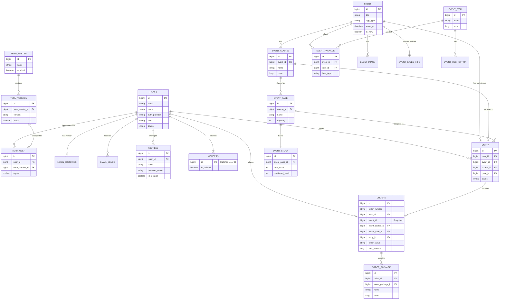

# Entity Relationship Diagram (ERD)

This diagram visualizes the relationships between the various entities in the On-Race database.

```mermaid
erDiagram
    USERS ||--o{ TERM_USER : "has agreements"
    USERS ||--o{ LOGIN_HISTORIES : "has history"
    USERS ||--o{ EMAIL_SENDS : "receives"
    USERS ||--o{ ADDRESS : "manages"
    USERS ||--|{ MEMBERS : "linked to"
    USERS ||--o{ ENTRY : "enters"
    USERS ||--o{ ORDERS : "places"

    TERM_MASTER ||--o{ TERM_VERSION : "contains"
    TERM_VERSION ||--o{ TERM_USER : "accepted in"

    EVENT ||--o{ EVENT_COURSE : "has"
    EVENT ||--o{ EVENT_PACKAGE : "offers"
    EVENT ||--o{ EVENT_IMAGE : "has"
    EVENT ||--|| EVENT_SALES_INFO : "defines policies"
    EVENT ||--o{ ENTRY : "has participants"
    
    EVENT_COURSE ||--o{ EVENT_PACE : "divided by"
    EVENT_COURSE ||--o{ ENTRY : "targeted in"
    
    EVENT_PACE ||--o{ ENTRY : "assigned to"
    EVENT_PACE ||--|| EVENT_STOCK : "tracks"
    
    EVENT_ITEM ||--o{ EVENT_ITEM_OPTION : "has"
    EVENT_ITEM ||--o{ EVENT_PACKAGE : "part of"
    
    ORDERS ||--o{ ORDER_PACKAGE : "contains"
    ENTRY ||--o| ORDERS : "linked to"

    %% Snapshot relationships (Loose coupling)
    %% ORDERS }o--|| EVENT : "Snapshot"
    %% ORDERS }o--|| EVENT_COURSE : "Snapshot"

    USERS {
        bigint id PK
        string email
        string name
        string auth_provider
        string role
        string status
    }

    MEMBERS {
        bigint id PK "Matches User ID"
        boolean is_deleted
    }

    EVENT {
        bigint id PK
        string title
        string app_type
        datetime event_at
        boolean is_view
    }

    EVENT_COURSE {
        bigint id PK
        bigint event_id FK
        string name
        long price
    }

    EVENT_PACE {
        bigint id PK
        bigint course_id FK
        string name
        int capacity
    }

    EVENT_STOCK {
        bigint id PK
        bigint event_pace_id FK
        int total_stock
        int confirmed_stock
    }

    ENTRY {
        bigint id PK
        bigint user_id FK
        bigint event_id FK
        bigint course_id FK
        bigint pace_id FK
        string status
    }

    ORDERS {
        bigint id PK
        string order_number
        bigint user_id FK
        bigint event_id "Snapshot"
        bigint event_course_id FK
        bigint event_pace_id FK
        bigint entry_id FK
        string order_status
        long final_amount
    }

    ORDER_PACKAGE {
        bigint id PK
        bigint order_id FK
        bigint event_package_id FK
        string name
        long price
    }

    EVENT_ITEM {
        bigint id PK
        string name
        long price
    }

    EVENT_PACKAGE {
        bigint id PK
        bigint event_id FK
        bigint item_id FK
        string item_type
    }

    ADDRESS {
        bigint id PK
        bigint user_id FK
        string label
        string receiver_name
        boolean is_default
    }

    TERM_MASTER {
        bigint id PK
        string name
        boolean required
    }

    TERM_VERSION {
        bigint id PK
        bigint term_master_id FK
        string version
        boolean active
    }

    TERM_USER {
        bigint id PK
        bigint user_id FK
        bigint term_version_id FK
        boolean agreed
    }
```
